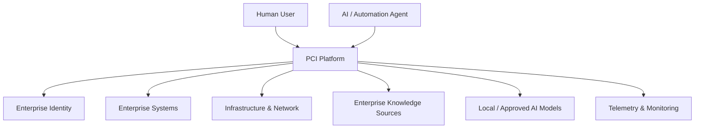

# PCI System Context

**ID:** ARCH-CTX-0001  
**Status:** Founding

## Context

PCI operates inside a customer's controlled environment and integrates with existing enterprise systems, infrastructure, data sources, AI runtimes, and operational tools.

## Architectural Boundary

PCI owns orchestration, governed knowledge, platform services, policies, agent execution controls, and user experiences. External systems remain authoritative for data that PCI does not own.

## Integration Principle

PCI must prefer standard protocols and documented APIs. Integrations must identify the external system's authoritative data domains and synchronization direction.

## Deployment Principle

The default enterprise deployment is on customer-controlled infrastructure. Internet access may be used for optional updates or external services, but core operation must not require it.
